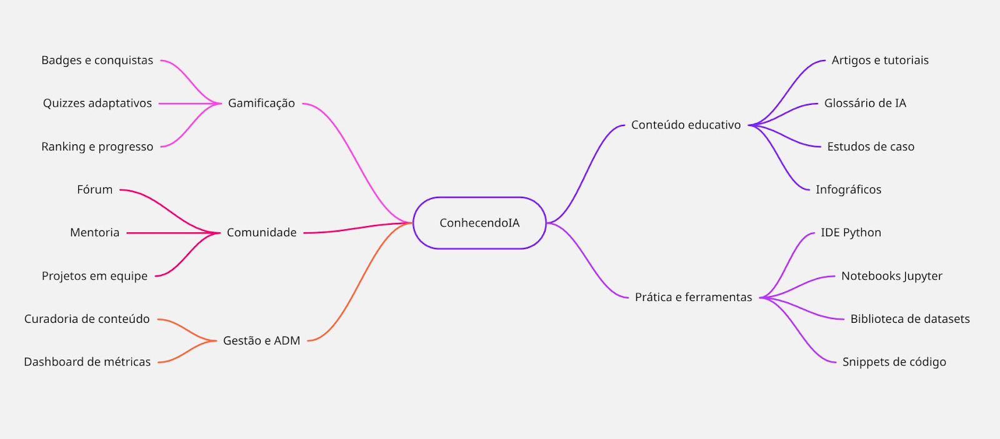

# 1.1.1. Unpack: Mapa Mental

## Introdução

O Mapa Mental é uma ferramenta visual utilizada na fase inicial do projeto para estruturar ideias e conceitos de forma não linear. No contexto do Conhecendo IA, este artefato desempenha o papel de consolidar os requisitos e ideias gerados na fase de Design Sprint, oferecendo uma visão clara do que está sendo construído. Ele serve como base para a organização das informações, planejamento de brainstormings e identificação de soluções para o fórum de Inteligência Artificial.

## Metodologia

A construção deste artefato utilizou a técnica de agrupamento por afinidade. A partir do núcleo central "Conhecendo IA", as funcionalidades e conceitos foram divididos em cinco pilares principais de valor:

- **Conteúdo Educativo**: Focado na teoria (artigos, glossário de IA, infográficos).
- **Prática e Ferramentas**: Focado no desenvolvimento (IDE Python, Notebooks Jupyter).
- **Gamificação**: Estratégias de retenção (badges, quizzes, rankings).
- **Comunidade**: Focado na interação social (fórum, mentoria, projetos em equipe).
- **Gestão e ADM**: Parte administrativa (dashboard de métricas, curadoria de conteúdo).

## Artefato Produzido

Abaixo, a representação estruturada da concepção inicial do projeto:

**Figura 1: Mapa Mental**

Autores: Todos os membros do grupo 03, 2026

## Percepções

Através do Mapa Mental foi possível ver exengar o projeto como um todo, a aplicação da técnica de agrupamento por afinidade revelou que o escopo do projeto vai muito além de um simples espaço de discussões. Quando colocamos tudo no papel em formato de teia, a equipe consegue olhar para um item, como: "Projetos em equipe" e debater sua viabilidade técnica antes de gastar dias desenhando telas para ele. O exercício de organizar as ideias de forma não linear garantiu que nenhuma necessidade do usuário ficasse para trás — desde o iniciante que precisa de um "Glossário de IA", até o desenvolvedor que busca "Datasets", passando por aquele que só quer discutir "Trending Topics" no fórum.

## Bibliografia

> * LUCIDCHART. O que é um mapa mental e como fazer um. Disponível em: https://www.lucidchart.com/pages/pt/o-que-e-mapa-mental-e-como-fazer. Acesso em: 3 abr. 2026.
> * Buzan, T. (2009). Mapas Mentais: Métodos criativos para estimular o raciocínio e usar ao máximo o potencial do seu cérebro. Editora Sextante.

### Histórico de Versão

| Data | Versão | Descrição | Autor(es) | Revisor(es) |
| :--- | :--- | :--- | :--- | :--- |
| 05/04/2026 | 1.0 | Criação do documento. | [Ingrid Alves](https://github.com/alvesingrid) e [Guilherme Gusmão ](https://github.com/gusmoles) |  [João Capozzi](https://github.com/jonas3688) |
