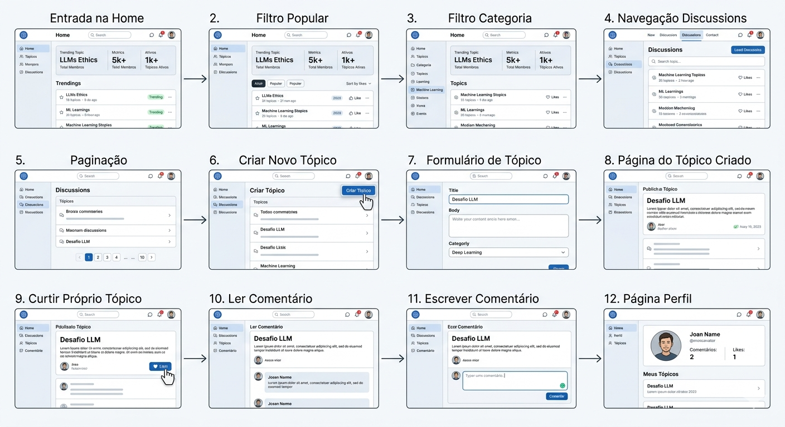

# 1.1.3 Decision (Storyboard)

## Visão Geral do Artefato
Na etapa de **Decision: Storyboard**, a equipe se depara com várias opções de caminhos críticos para o protótipo. O objetivo do Storyboard não é inventar novas ideias, mas sim tomar decisões difíceis sobre quais ideias das etapas anteriores serão testadas e como elas se conectam em um fluxo de usuário coeso.

Nesta fase, a equipe "costura" as melhores soluções escolhidas em uma narrativa visual passo a passo. O Storyboard serve como o projeto (blueprint) detalhado para o protótipo que será construído no dia seguinte. Ele remove ambiguidades, define a sequência exata de telas e interações, e garante que todos os membros da equipe (designers, desenvolvedores e stakeholders) estejam alinhados sobre o que será construído e testado com usuários reais. Isso evita desperdício de tempo construindo funcionalidades desnecessárias ou fluxos confusos durante a fase de prototipagem.

## Artefato Produzido
Abaixo, apresenta-se o fluxo narrativo escolhido pela equipe para guiar a construção do protótipo de alta fidelidade da plataforma **ConhecendoIA**.

**Figura 3: Storyboard do Fluxo de Usuário**

**Autores:** Grupo G3, 2026.

## Percepções

A construção do documento e do cenário de Storyboard para o projeto ConhecendoIA, foi fundamental para a validação e refinamento da visão que o grupo tem sobre o produto, pois aqui saímos das ideias pensamos na usabilidade real e na jornada do usuário passo a passo.
Sobre o fluxo do projeto, a principal parte de discussão foi as categorias selecionadas para o fórum, pois ao invés de permitir os usuários criar, acarretando em inúmeras categorias e sobrecarregar novos usuário, decidimos escolher as categorias mais revelantes sobre inteligências artificiais. 

## Bibliografia
> * [WebSite] GV (Google Ventures). The Design Sprint - Storyboarding. Disponível em: https://www.gv.com/sprint/.
> * Nielsen Norman Group (NN/g). Artigos e pesquisas sobre User Journey Mapping e Storyboarding in UX Design.

## Histórico de Versão
| Versão | Data | Descrição | Autor | Revisor |
| :--- | :--- | :--- | :--- | :--- |
| 1.0 | 05/04/2026 | Criação do documento e descrição da etapa de Storyboarding | [Davi Rodrigues](https://github.com/davirnunes) e [Mariana](https://github.com/marianaps2701)| [Ingrid Alves](https://github.com/alvesingrid) |
