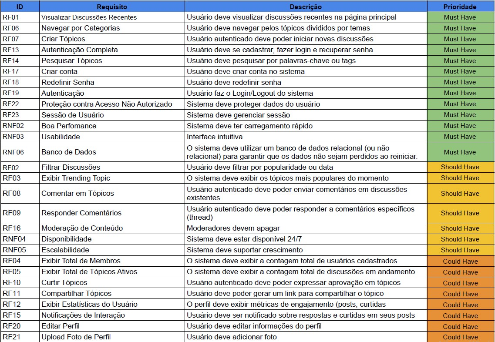

# 1.1.8 Priorização MoSCoW

## Visão Geral do Artefato
A técnica **MoSCoW** é uma ferramenta de priorização utilizada na gestão de produtos e projetos para alcançar um entendimento comum entre os stakeholders sobre a importância da entrega de cada requisito. A sigla representa quatro categorias de prioridade:

* **Must Have (Deve ter):** Requisitos críticos para o sucesso do sistema.
* **Should Have (Deveria ter):** Requisitos importantes, mas não vitais para a entrega inicial.
* **Could Have (Poderia ter):** Requisitos desejáveis que aumentam a satisfação do usuário (opcionais).
* **Won't Have (Não terá por enquanto):** Requisitos que não serão incluídos nesta entrega, mas podem ser considerados no futuro.

---

## Tabela de Priorização (MoSCoW)

### Requisitos Funcionais (RF)

| ID | Requisito | Descrição | Priorização |
|:---:|:---|:---|:---:|
| RF01 | Visualizar Discussões Recentes | Usuário deve visualizar discussões recentes na página principal | **Must Have** |
| RF02 | Filtrar Discussões | Usuário deve filtrar por popularidade ou data | **Should Have** |
| RF03 | Exibir Trending Topic | O sistema deve exibir os tópicos mais populares do momento | **Should Have** |
| RF04 | Exibir Total de Membros | O sistema deve exibir a contagem total de usuários cadastrados | **Could Have** |
| RF05 | Exibir Total de Tópicos Ativos | O sistema deve exibir a contagem total de discussões em andamento | **Could Have** |
| RF06 | Navegar por Categorias | Usuário deve navegar pelos tópicos divididos por temas | **Must Have** |
| RF07 | Criar Tópicos | Usuário autenticado deve poder iniciar novas discussões | **Must Have** |
| RF08 | Comentar em Tópicos | Usuário autenticado deve poder enviar comentários em discussões | **Should Have** |
| RF09 | Responder Comentários | Usuário autenticado deve poder responder a comentários (threads) | **Should Have** |
| RF10 | Curtir Tópicos | Usuário autenticado deve poder expressar aprovação em tópicos | **Could Have** |
| RF11 | Compartilhar Tópicos | Usuário deve poder gerar um link para compartilhar o tópico | **Could Have** |
| RF12 | Exibir Estatísticas do Usuário | O perfil deve exibir métricas de engajamento (posts, curtidas) | **Could Have** |
| RF13 | Autenticação Completa | Usuário deve se cadastrar, fazer login e recuperar senha | **Must Have** |
| RF14 | Pesquisar Tópicos | Usuário deve pesquisar por palavras-chave ou tags | **Must Have** |
| RF15 | Notificações de Interação | Usuário deve ser notificado sobre respostas e curtidas | **Could Have** |
| RF16 | Moderação de Conteúdo | Moderadores devem apagar tópicos/comentários impróprios | **Should Have** |
| RF17 | Criar conta | Usuário deve criar conta no sistema | **Must Have** |
| RF18 | Redefinir Senha | Usuário deve redefinir senha | **Must Have** |
| RF19 | Autenticação | Usuário faz o Login/Logout do sistema | **Must Have** |
| RF20 | Editar Perfil | Usuário deve editar informações do perfil | **Could Have** |
| RF21 | Upload Foto de Perfil | Usuário deve adicionar foto | **Could Have** |
| RF22 | Proteção de Acesso | Sistema deve proteger dados do usuário contra acessos indevidos | **Must Have** |
| RF23 | Sessão de Usuário | Sistema deve gerenciar a sessão ativa do usuário | **Must Have** |

### Requisitos Não Funcionais (RNF)

| ID | Requisito | Descrição | Priorização |
|:---:|:---|:---|:---:|
| RNF01 | Interface Responsiva | Sistema deve funcionar em dispositivos mobile | **Could Have** |
| RNF02 | Boa Performance | Sistema deve ter carregamento rápido e fluidez | **Must Have** |
| RNF03 | Usabilidade | Interface intuitiva e de fácil aprendizado | **Must Have** |
| RNF04 | Disponibilidade | Sistema deve estar disponível 24/7 | **Should Have** |
| RNF05 | Escalabilidade | Sistema deve suportar o crescimento da base de usuários | **Should Have** |
| RNF06 | Banco de Dados | Persistência de dados em banco relacional ou não relacional | **Must Have** |
| RNF07 | Conformidade LGPD | Tratamento de dados conforme a Lei Geral de Proteção de Dados | **Should Have** |

---

### Tabela MoSCoW

## Referências
* DSDM Consortium. **The MoSCoW Method**. Agile Business Consortium.

## Histórico de Versão
| Versão | Data | Descrição | Autor | Revisor |
| :--- | :--- | :--- | :--- | :--- |
| 1.0 | 05/04/2026 | Aplicação da técnica MoSCoW para priorização de requisitos | [João Capozzi](https://github.com/jonas3688) | [Ingrid Alves](https://github.com/alvesingrid)  |