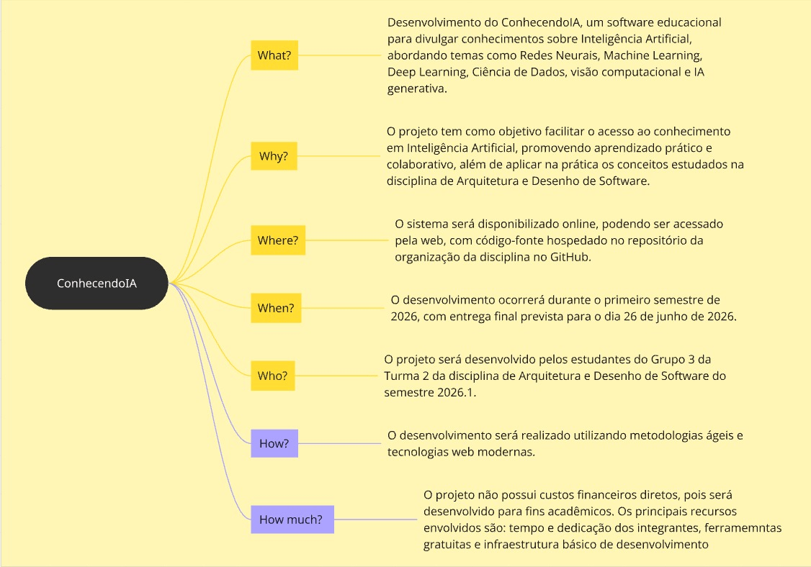

# 1.2.2 5W2H

O **5W2H** é uma ferramenta de planejamento utilizada para estruturar e organizar ações de um projeto de forma clara e objetiva. O nome vem de sete perguntas fundamentais:

- **What (O quê?)**
- **Why (Por quê?)**
- **Where (Onde?)**
- **When (Quando?)**
- **Who (Quem?)**
- **How (Como?)**
- **How much (Quanto custa?)**

Esse artefato é amplamente utilizado em gestão de projetos porque ajuda a garantir que todos os aspectos essenciais de uma iniciativa sejam definidos, facilitando a comunicação entre a equipe e orientando a execução das atividades.

No contexto do projeto **ConhecendoIA**, o 5W2H permite descrever de forma estruturada como o sistema será desenvolvido, seus objetivos, responsáveis, prazos e recursos envolvidos, servindo como base para o planejamento e acompanhamento do projeto ao longo do semestre.

**Autores:** Mariana Pereira, Arthur Fernandes, 2026
