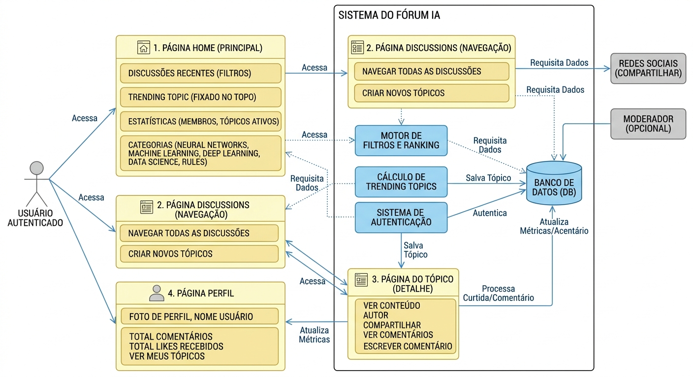

# 1.2.3 Rich Picture

### Rich Picture ConhecendoIA

O Rich Picture (ou "Quadro Rico") é uma ferramenta fundamental de modelagem de sistemas, originada da Soft Systems Methodology (SSM) de Peter Checkland. Ao invés de usar notações formais e rígidas, o Rich Picture encoraja a criação de um diagrama pictórico e informal. Este diagrama captura, de forma abrangente, todos os elementos-chave de uma situação: os atores envolvidos, os processos, as estruturas de dados, os fluxos de informação, os relacionamentos e, crucialmente, os pontos de conflito, preocupações e o contexto social ou político.
No contexto deste projeto, a utilização do Rich Picture é estratégica por várias razões. O sistema proposto possui múltiplas funcionalidades e fluxos de interação (como a criação de tópicos, comentários, curtidas, filtragens de trending e navegação em perfis) que podem, se não visualizados corretamente, levar a mal-entendidos durante o desenvolvimento. O diagrama permite que a equipe de desenvolvimento, designers e proprietários do projeto vejam como as quatro páginas principais (Home, Discussions, Tópico e Perfil) se conectam e como os dados dos usuários influenciam os rankings de popularidade e trending. Ele serve como um mapa visual para validar se a arquitetura de navegação atende às necessidades de usabilidade e para antecipar como as funcionalidades de interação (como as curtidas) se traduzirão em métricas de perfil.

### Artefato Produzido

**Figura 6: RichPicture**

## Referências
> CTEC2402 Software Development Project - Introducing Rich Pictures. Acesso em: 02/04/2026.

## Histórico de Versão
| Versão | Data | Descrição | Autor | Revisor |
| :--- | :--- | :--- | :--- | :--- |
| 1.0 | 05/04/2026 | Criação do documento Rich Picture | [João Fonseca](https://github.com/joaoguilherme14) e [Caio Miranda](https://github.com/cvbmiranda) | [Ingrid Alves](https://github.com/alvesingrid) |