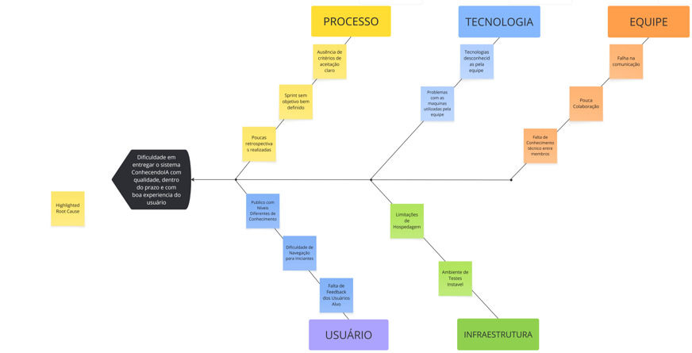
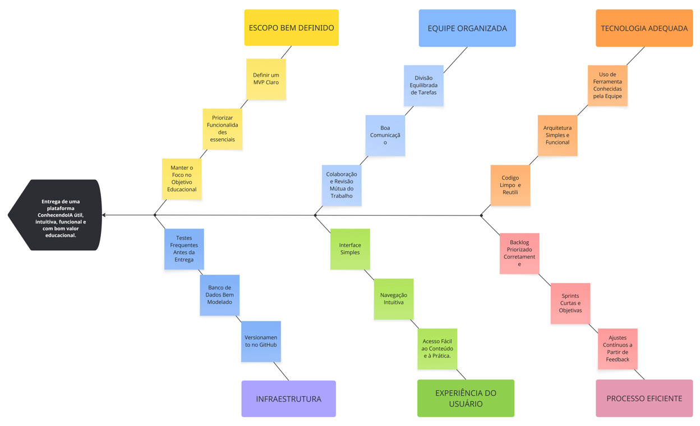

# 1.2.4. Diagrama de Causa e Efeito (Ishikawa)

## Introdução

A crescente demanda por conhecimento em Inteligência Artificial tem impulsionado o desenvolvimento de plataformas educacionais digitais. Nesse contexto, o projeto **ConhecendoIA** surge com o objetivo de facilitar o aprendizado de temas como Machine Learning, Deep Learning e Ciência de Dados, por meio de uma abordagem prática e acessível.

Para analisar os fatores que influenciam o sucesso ou as dificuldades do projeto, foi utilizado o **Diagrama de Causa e Efeito (Ishikawa)**, uma ferramenta amplamente aplicada na identificação de causas de problemas em processos.

## Metodologia

O diagrama foi estruturado com base no modelo dos **6Ms** (Método, Máquina, Mão de obra, Material, Medida e Meio ambiente), adaptado para o contexto de desenvolvimento de software.

No projeto ConhecendoIA, as categorias foram reinterpretadas como:

- **Método** → Processo Scrum
- **Mão de obra** → Equipe
- **Máquina** → Tecnologias utilizadas
- **Material** → Conteúdo educacional
- **Meio ambiente** → Infraestrutura e ambiente de desenvolvimento
- **Medida** → Avaliação de desempenho e progresso

## Artefatos Produzidos

Abaixo, os diagramas elaborados para analisar diferentes cenários do projeto:

### Figura 7: Diagrama de Causa e Efeito - Dificuldade em entregar o sistema Conhecendo IA

### Figura 8: Diagrama de Causa e Efeito - Entrega de uma plataforma ConhecendoIA

## Link do Miro

Você pode acessar a versão interativa dos diagramas no Miro através do link abaixo:
- [Miro - ConhecendoIA](https://miro.com/welcomeonboard/RS9NUVlWZVB5dzBwN0MzdkxJSk5MZkpvSXNtZFhFWEVKSUFMUDJ6MFNRd2I4QXJpOGZnQWRFYklQM3RiK0ViQS9pWFdOZmRaS3hLRjlvdXlpeVhaTE5xc2pNYVZCMXNtdjl2dFZ5cWdqcUVZWGFwNk5YVEhmL0tuYkdKNjdYRVVNakdSWkpBejJWRjJhRnhhb1UwcS9BPT0hdjE=?share_link_id=648124105706)

## Referências

- SOMMERVILLE, Ian. **Engenharia de Software**. 10. ed. São Paulo: Pearson, 2019.
- ISHIKAWA, Kaoru. **Controle de qualidade total: à maneira japonesa**. Rio de Janeiro: Campus, 1993.

| Data | Versão | Descrição | Autor(es) | Revisor(es) |
| :--- | :--- | :--- | :--- | :--- |
| 05/04/2026 | 1.0 | Criação do documento. | [Davi Rodrigues](https://github.com/davirnunes) |  [Guilherme Gusmão ](https://github.com/gusmoles) | [Ingrid Alves](https://github.com/alvesingrid) |

