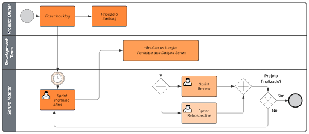

# 1.3.1 Scrum

A modelagem apresentada utiliza a notação BPMN (Business Process Model and Notation) para representar o fluxo de trabalho do framework Scrum no desenvolvimento de software. O objetivo desse diagrama é ilustrar, de forma visual e organizada, como as atividades são distribuídas entre os principais papéis do Scrum: Product Owner, Scrum Master e Time de Desenvolvimento.

Por meio do uso de lanes (faixas), o modelo evidencia as responsabilidades de cada agente envolvido, além de demonstrar a sequência das atividades, eventos e decisões que ocorrem ao longo das Sprints, desde a criação do backlog até a finalização do projeto.

O processo se inicia na lane do Product Owner, responsável por criar e priorizar o Product Backlog. Essas atividades definem quais funcionalidades ou requisitos possuem maior valor para o produto e devem ser desenvolvidos primeiro.

Após essa etapa, o fluxo segue para a lane do Scrum Master, onde ocorre a Sprint Planning Meeting. Esse evento marca o início do ciclo de desenvolvimento (Sprint), no qual são discutidos e alinhados os itens do backlog que serão trabalhados.

Em seguida, o processo avança para o Time de Desenvolvimento, que é responsável por:
* Executar as tarefas definidas
* Participar das reuniões diárias (Daily Scrum)

Essa fase representa a execução da Sprint, onde o produto é efetivamente desenvolvido.

Após a execução, o fluxo passa por um gateway paralelo, permitindo a realização de duas atividades importantes:
* Sprint Review: avaliação do incremento desenvolvido
* Sprint Retrospective: análise do processo e identificação de melhorias

Essas atividades podem ocorrer de forma independente, mas ambas são essenciais para garantir qualidade contínua e evolução da equipe.

Na sequência, um gateway exclusivo realiza a verificação: “O projeto foi finalizado?”.
* Se sim, o processo é encerrado.
* Se não, o fluxo retorna para a etapa de planejamento, iniciando uma nova Sprint.

---
### Artefato Produzido

**Figura 9: Piscina do Scrum**

**Autores:** Mariana Pereira, Ingrid Alves e Guilherme Gusmão, 2026.

---

## Referências
> SCHWABER, Ken; SUTHERLAND, Jeff. **The Scrum Guide**. Scrum.org, 2020.

## Histórico de Versão
| Versão | Data | Descrição | Autor | Revisor |
| :--- | :--- | :--- | :--- | :--- |
| 1.0 | 05/04/2026 | Documentação da modelagem BPMN para Scrum | [Guilherme Gusmão ](https://github.com/gusmoles) & [Mariana](https://github.com/marianaps2701) | [Ingrid Alves](https://github.com/alvesingrid) |
| 1.1 | 06/04/2026 | Adição dos autores da imagem| [Ingrid Alves](https://github.com/alvesingrid)| [Guilherme Gusmão ](https://github.com/gusmoles) |