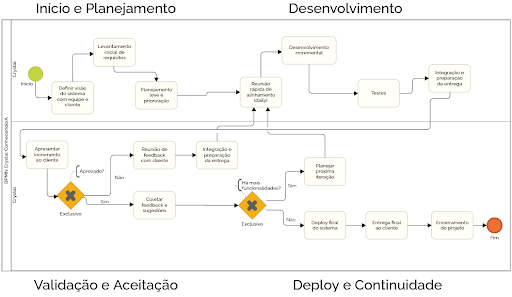

# 1.3.4 Crystal

## Dinâmica da Metodologia

A modelagem BPMN apresentada representa o fluxo de trabalho baseado na metodologia Crystal, uma abordagem ágil centrada em pessoas, comunicação e adaptação contínua. O processo inicia com o entendimento e planejamento do projeto, seguido por ciclos iterativos de desenvolvimento em pequenos incrementos.

Durante esses ciclos, as funcionalidades são desenvolvidas, verificadas e validadas, garantindo qualidade e aderência aos requisitos. Em seguida, ocorre a validação com o cliente, permitindo feedback constante e alinhamento com as necessidades reais.

Após essa etapa, o sistema é disponibilizado (deploy), mas o processo continua de forma cíclica, permitindo evolução contínua. O uso de pontos de decisão no fluxo reforça a possibilidade de ajustes e retornos, destacando o caráter iterativo, incremental e adaptativo da metodologia Crystal.

### Fases do Fluxo

**Entendimento e Planejamento:** O processo se inicia com a definição de requisitos e o alinhamento de expectativas da equipe, estabelecendo a base para o desenvolvimento.

**Ciclo Iterativo (Core Crystal):** Característica central da metodologia, onde as atividades são executadas em pequenos incrementos, permitindo entregas frequentes e ajustes rápidos conforme a necessidade do projeto.

**Desenvolvimento e Verificação:** Durante a execução, as funcionalidades são construídas e submetidas a testes e validações, garantindo a qualidade esperada e a conformidade com os requisitos.

**Validação e Aceitação:** O cliente ou usuário final avalia o produto, promovendo feedback contínuo e alinhamento com as necessidades reais.

**Deploy e Continuidade:** O sistema é disponibilizado para uso, mantendo um ciclo contínuo de manutenção, melhorias e evolução constante.

### Dinâmica de Controle

O diagrama utiliza gateways (decisões) estratégicos que permitem o retorno a etapas anteriores caso os critérios de aceitação não sejam atingidos, reforçando o caráter adaptativo do processo.

### Resumo

O fluxo ilustra um processo ágil, iterativo e incremental, no qual desenvolvimento, validação e entrega ocorrem de forma contínua, com forte ênfase na colaboração, no feedback constante e na adaptação — princípios fundamentais da metodologia Crystal.

---
### Artefato Produzido

**Figura X: Piscina da Crystal**

**Autores:** Caio Miranda e Vinícius Ribeiro, 2026.

---
### Referências Bibliográficas
> * COCKBURN, Alistair. **Crystal Clear**: A Human-Powered Methodology for Small Teams. Addison-Wesley, 2004.
> * SERRANO, Milene. Material de Apoio: Metodologia Crystal. UnB/FGA.

### Histórico de Versão
| Versão | Data | Descrição | Autor | Revisor |
| :--- | :--- | :--- | :--- | :--- |
| 1.0 | 05/04/2026 | Documentação da modelagem BPMN para Crystal | [Caio Miranda](https://github.com/cvbmiranda) & [Vinícius Ribeiro](https://github.com/viniiribeiro)| [Ingrid Alves](https://github.com/alvesingrid) |