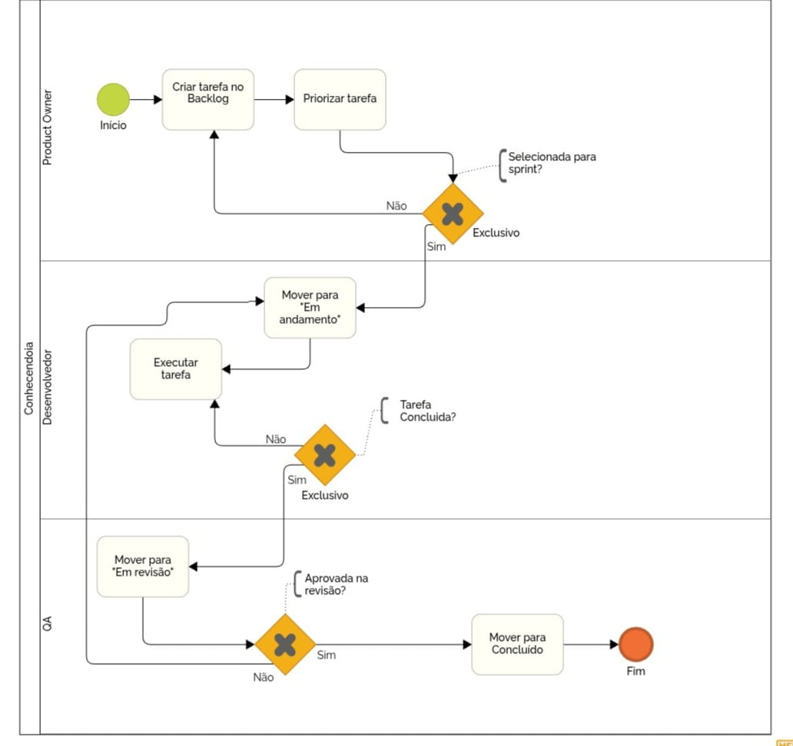

# 1.3. Módulo Modelagem BPMN

## Introdução

Para o desenvolvimento deste projeto, optamos por adotar metodologias ágeis a fim de garantir maior flexibilidade e entregas contínuas de valor. O uso de práticas ágeis nos permite uma adaptação mais rápida a possíveis mudanças de requisitos, promove uma comunicação mais transparente entre os membros da equipe e mantém um foco contínuo na qualidade do produto, mitigando riscos de forma iterativa.

## Metodologias Adotadas

A fim de aproveitar os pontos fortes de diferentes abordagens e moldar o processo à nossa realidade, combinamos práticas das seguintes metodologias: **eXtreme Programming (XP), Kanban, Scrum e Crystal**. A união desses frameworks tem como objetivo criar um ambiente de trabalho organizado e sustentável, alinhando a gestão do fluxo de trabalho com práticas robustas de engenharia de software e foco na interação da equipe.

Abaixo, detalhamos o porquê e em qual aspecto utilizaremos cada uma delas, de modo que a combinação seja a mais eficiente possível:

* **Scrum:** Servirá como a base da nossa gestão e planejamento de projeto. Utilizaremos o Scrum para estruturar o fluxo de trabalho em *Sprints* (ciclos curtos) e utilizar suas cerimônias (como *Planning*, *Reuniões Rápidas de Acompanhamento*, *Review* e *Retrospective*). Ele será aplicado para garantir previsibilidade nas entregas e facilitar a avaliação periódica do progresso da equipe.
* **eXtreme Programming (XP):** Será focado inteiramente nas práticas técnicas de desenvolvimento. Enquanto o Scrum organiza o planejamento, o XP guiará a qualidade do código. Adotaremos práticas como *Pair Programming* (programação em par), revisões contínuas, simplicidade de design e integração contínua, sendo utilizado onde for essencial evitar débitos técnicos e aumentar a segurança do software criado.
* **Kanban:** Implementado para a gestão visual das atividades no dia a dia. Através de um quadro (*To Do*, *In Progress*, *Review*, *Done*), controlaremos de forma transparente o status de tudo o que está sendo desenvolvido. O Kanban será fundamental para ajudar a identificar possíveis gargalos e limitar o trabalho em andamento, assegurando que as tarefas da *Sprint* fluam sem travar a equipe.
* **Crystal:** Norteará o lado humano e de comunicação. Como a família Crystal defende que o talento e as interações humanas são mais importantes que quaisquer processos rígidos, aplicaremos seus princípios buscando um ambiente de "comunicação osmótica", garantindo segurança psicológica e permitindo que a nossa forma de trabalhar se adapte organicamente ao tamanho da equipe e à evolução do projeto.

### 1.3.1 Scrum

A modelagem apresentada utiliza a notação BPMN (Business Process Model and Notation) para representar o fluxo de trabalho do framework Scrum no desenvolvimento de software. O objetivo desse diagrama é ilustrar, de forma visual e organizada, como as atividades são distribuídas entre os principais papéis do Scrum: Product Owner, Scrum Master e Time de Desenvolvimento.

Por meio do uso de lanes (faixas), o modelo evidencia as responsabilidades de cada agente envolvido, além de demonstrar a sequência das atividades, eventos e decisões que ocorrem ao longo das Sprints, desde a criação do backlog até a finalização do projeto.

O processo se inicia na lane do Product Owner, responsável por criar e priorizar o Product Backlog. Essas atividades definem quais funcionalidades ou requisitos possuem maior valor para o produto e devem ser desenvolvidos primeiro.

Após essa etapa, o fluxo segue para a lane do Scrum Master, onde ocorre a Sprint Planning Meeting. Esse evento marca o início do ciclo de desenvolvimento (Sprint), no qual são discutidos e alinhados os itens do backlog que serão trabalhados.

Em seguida, o processo avança para o Time de Desenvolvimento, que é responsável por:
* Executar as tarefas definidas
* Participar das reuniões diárias (Daily Scrum)

Essa fase representa a execução da Sprint, onde o produto é efetivamente desenvolvido.

Após a execução, o fluxo passa por um gateway paralelo, permitindo a realização de duas atividades importantes:
* **Sprint Review:** avaliação do incremento desenvolvido
* **Sprint Retrospective:** análise do processo e identificação de melhorias

Essas atividades podem ocorrer de forma independente, mas ambas são essenciais para garantir qualidade contínua e evolução da equipe.

Na sequência, um gateway exclusivo realiza a verificação: “O projeto foi finalizado?”.
* **Se sim**, o processo é encerrado.
* **Se não**, o fluxo retorna para a etapa de planejamento, iniciando uma nova Sprint.

### 1.3.2 Kanban

A modelagem apresentada utiliza a notação BPMN para representar o fluxo de trabalho baseado no método Kanban. O objetivo deste diagrama é ilustrar de forma visual e organizada o fluxo contínuo de entrega de valor e como as atividades são distribuídas entre os diferentes papéis envolvidos no processo.

Por meio do uso de faixas horizontais, o modelo evidencia as responsabilidades de cada agente em um sistema ágil focado em fluxo contínuo, estruturado da seguinte forma:

* **Product Owner:** O processo se inicia nesta faixa, onde este papel é responsável por criar a tarefa no backlog e definir a sua prioridade técnica e de negócio. Em seguida, um desvio de decisão exclusivo verifica se a demanda foi selecionada para o ciclo atual de desenvolvimento. Se a resposta for negativa, a tarefa retorna à etapa inicial do backlog aguardando nova priorização; se positiva, avança para a engenharia.

* **Desenvolvedor:** Nesta etapa, a demanda entra efetivamente na fase de construção. O profissional realiza a transição da tarefa para o status de andamento e inicia a sua execução técnica. Um novo desvio de decisão avalia internamente se o trabalho foi totalmente concluído pelo programador. Caso restem pendências ou impedimentos, o desenvolvedor retoma a execução. Quando a tarefa atinge os critérios de finalização de código, ela avança para a validação.

* **Qualidade (QA):** O fluxo desce então para a faixa final, iniciando com a movimentação do item para o status de revisão. Um terceiro desvio atua como controle estrito de qualidade para checar se o incremento construído está aprovado segundo os requisitos originais. Se houver falhas ou não conformidades, o processo retorna automaticamente para a faixa do Desenvolvedor para que os erros sejam corrigidos. Se a entrega for validada e aprovada, a demanda segue para a etapa de conclusão, alcançando o evento de fim e encerrando o ciclo daquela tarefa com sucesso.

**Autores:** Arthur Fernandes Alencar e João Capozzi, 2026

### Histórico de Versão

| Versão | Data       | Descrição                                | Autor            | Revisor          |
|--------|------------|------------------------------------------|------------------|------------------|
| 1.0    | 04/04/2026 | Criação inicial do documento             | [Vinícius Ribeiro](https://github.com/viniiribeiro) | [Ingrid Alves](https://github.com/alvesingrid) |
| 1.1    | 05/04/2026 | Criação da sessão 1.3.2 Kanban           | [João Capozzi](https://github.com/jonas3688) | [Aguardando Revisão]() |
| 1.2    | 05/04/2026 | Criação da sessão 1.3.1 Scrumç            | [Ingrid Alves](https://github.com/alvesingrid) | [Mariana Pereira da Silva ](https://github.com/marianaps2701) |
